# Graphical User Interface Prototype  - FUTURE

Authors: Francesco Santoro, Rafael Lapetina Ribeiro Gomes, Eric Yugo Hioki, Neda Saadat

Date: 28/04/2023

Version: V2

### Login interface page
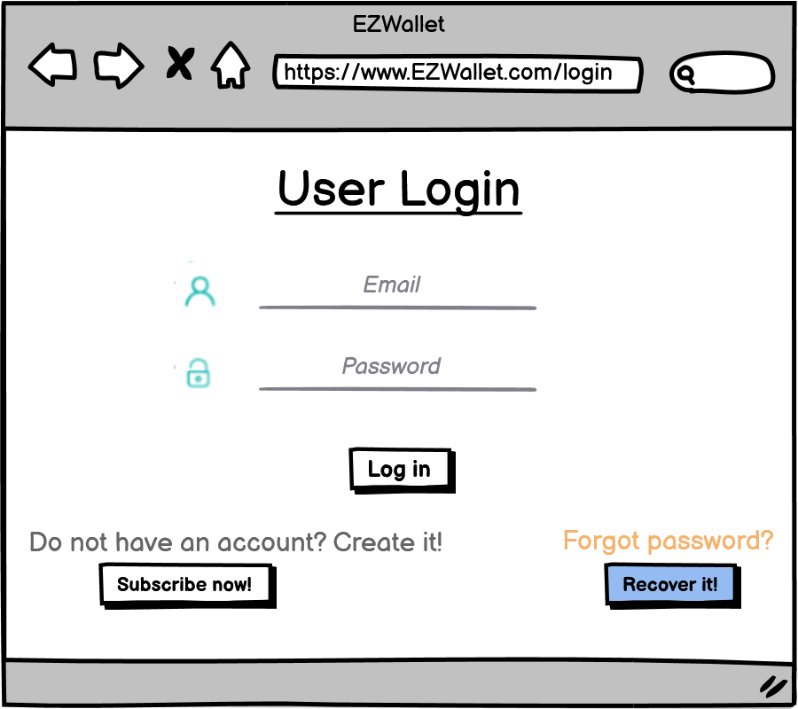

### User not found error

### Wrong credentials error

### User not registered error

### User already logged in

### Password recovery page
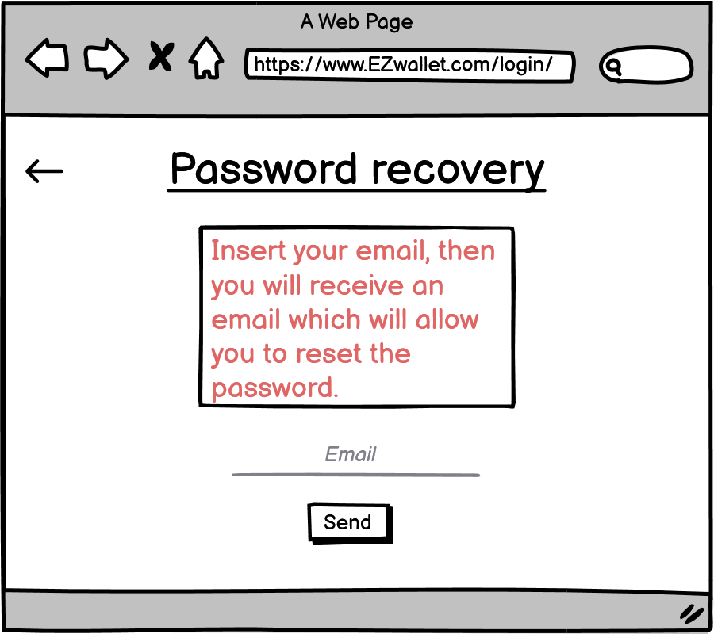

### Registration page
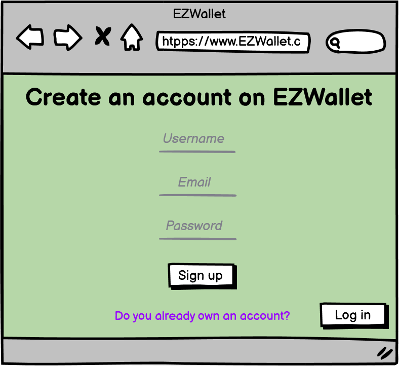

### User already registered error

### User added succesfully

### Already Logged out page

### User not authorized error

### My categories page
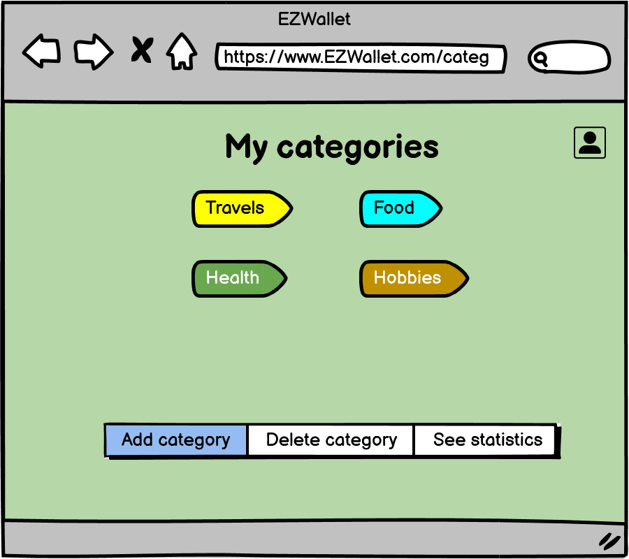

### Add category page
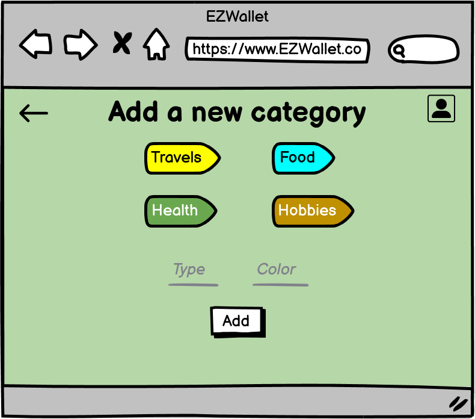

### Delete category page
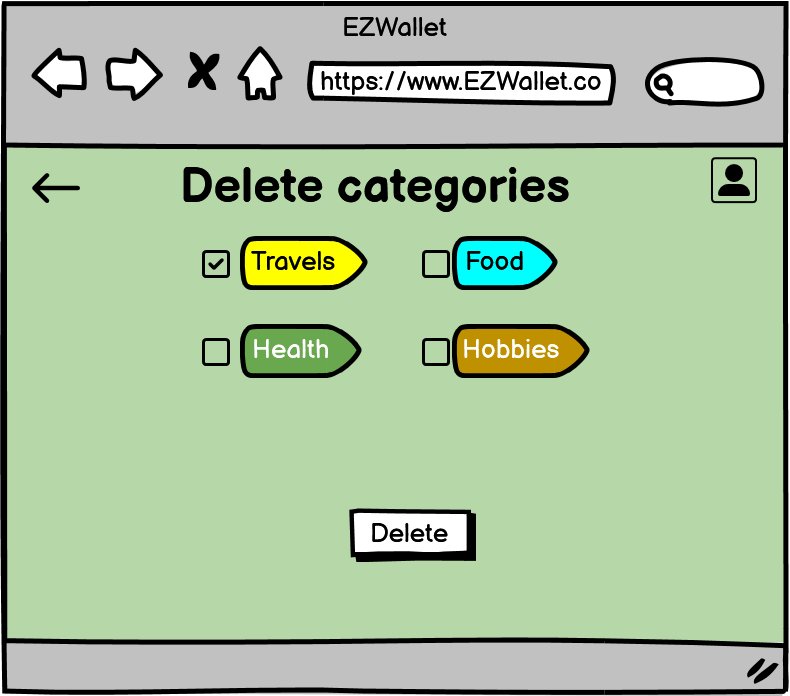

### Delete account page
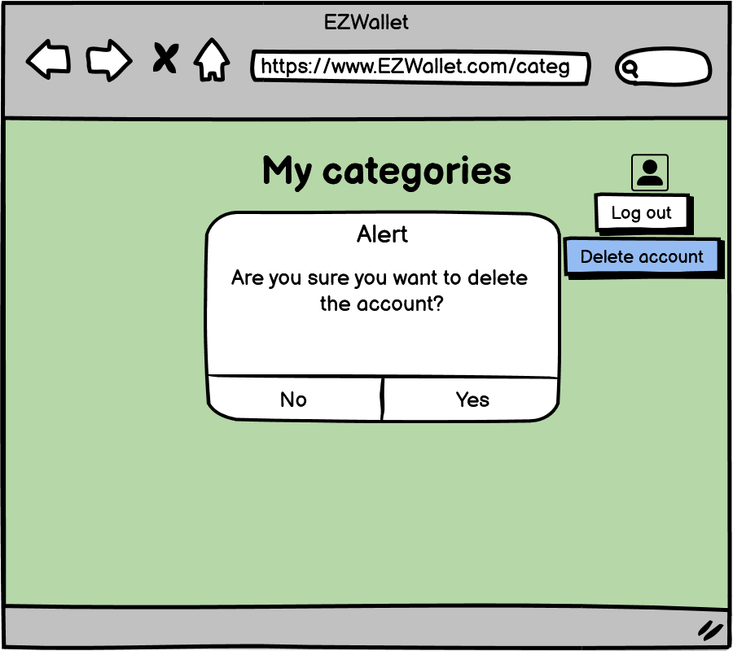

### Single category page
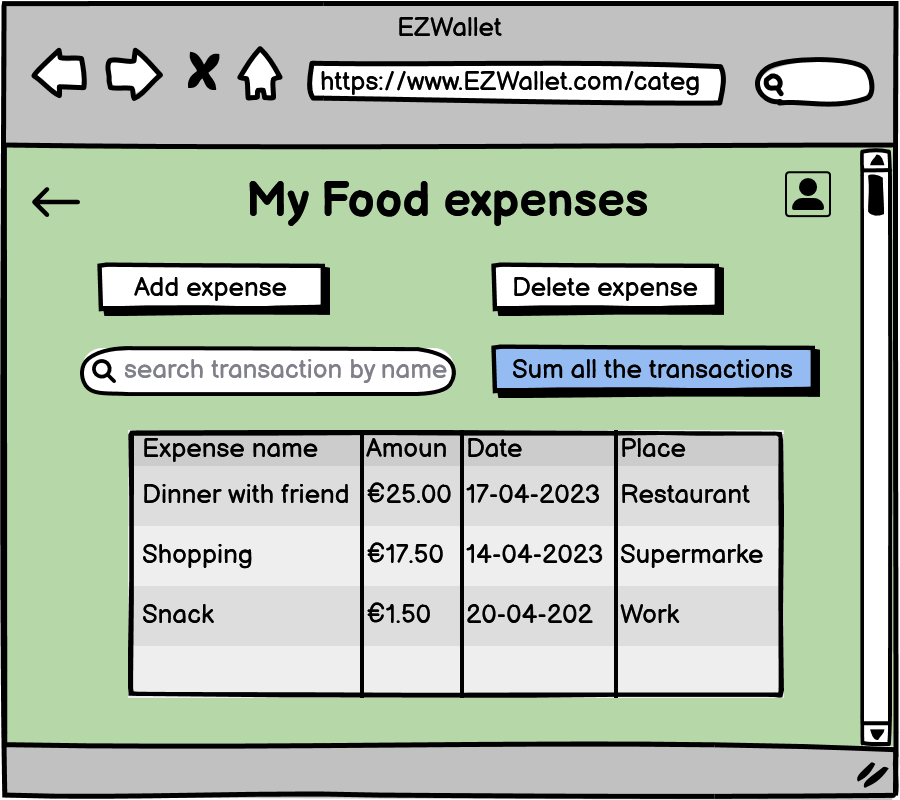

### Sum of all transactions' page
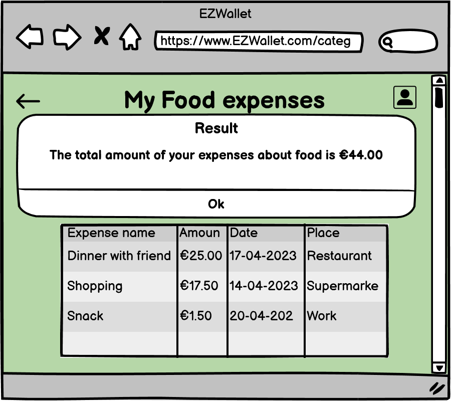

### Delete expense page
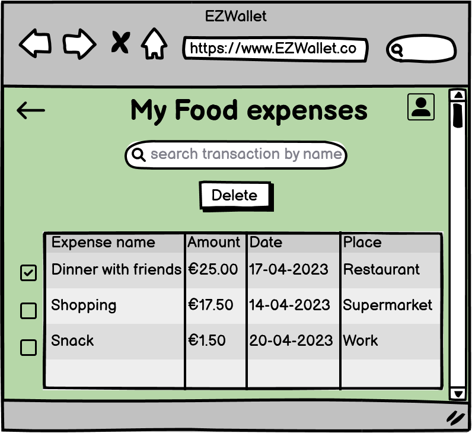

### Statistics page
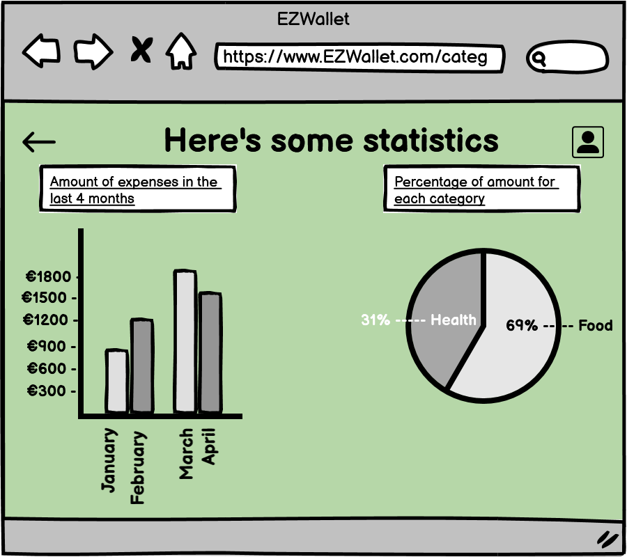

### Add expense page
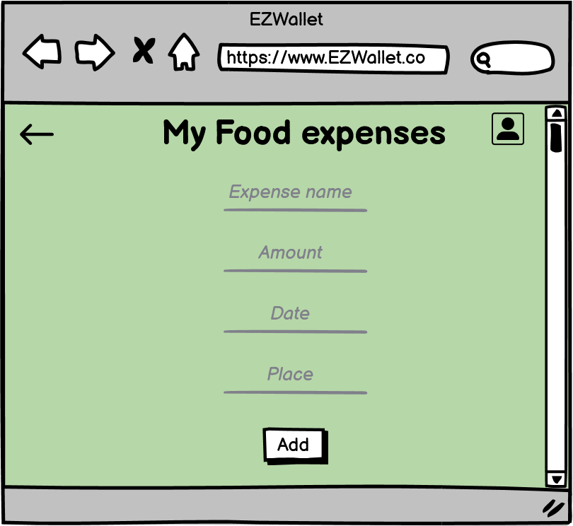

### Log out page
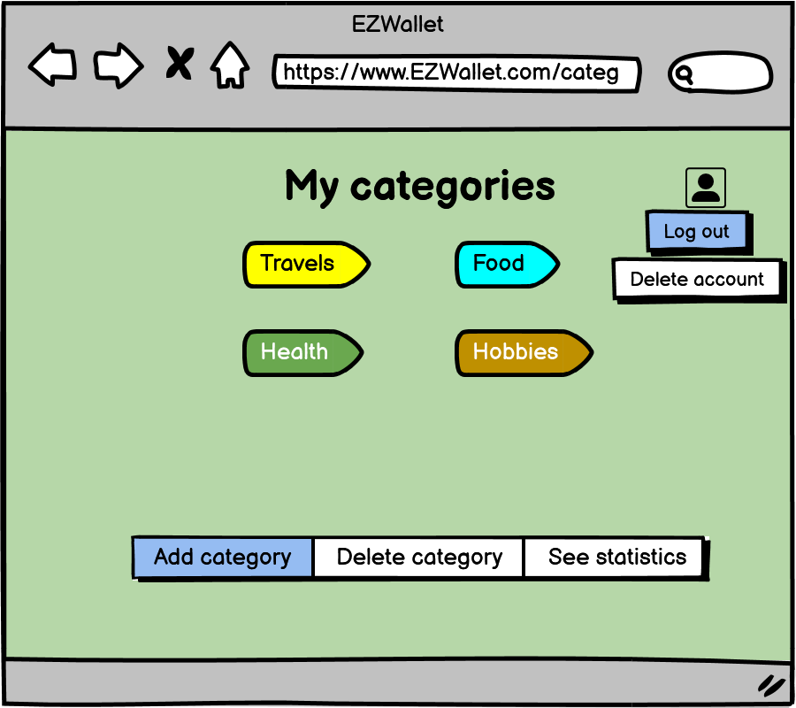

