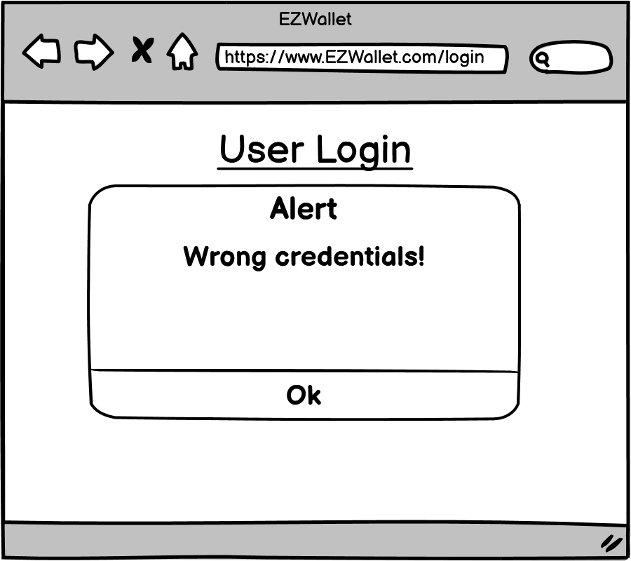
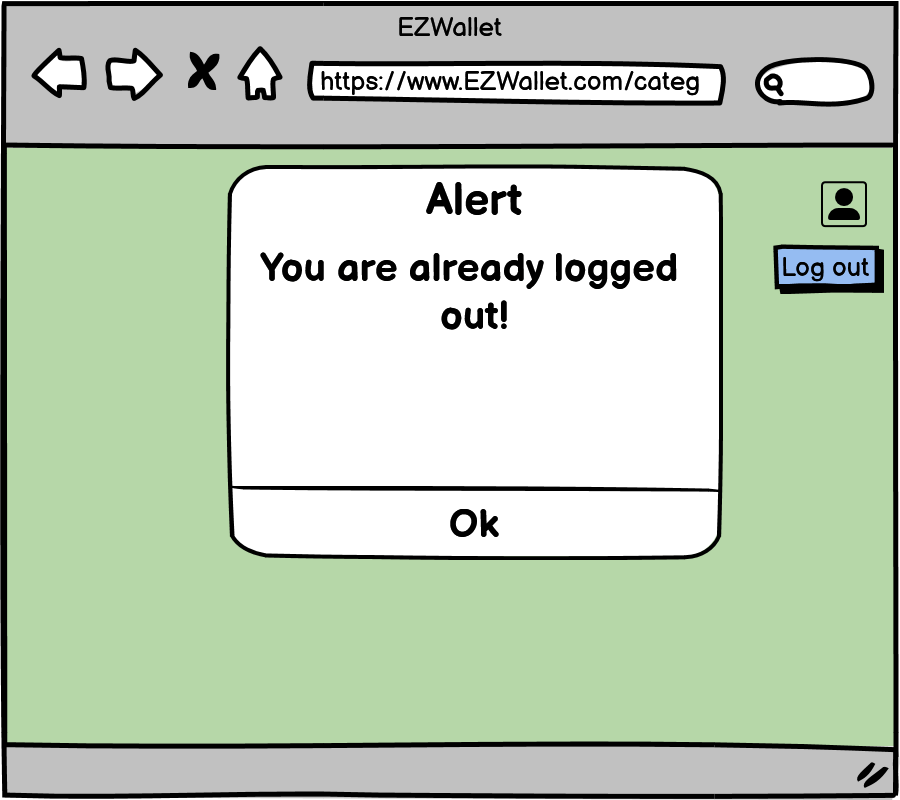
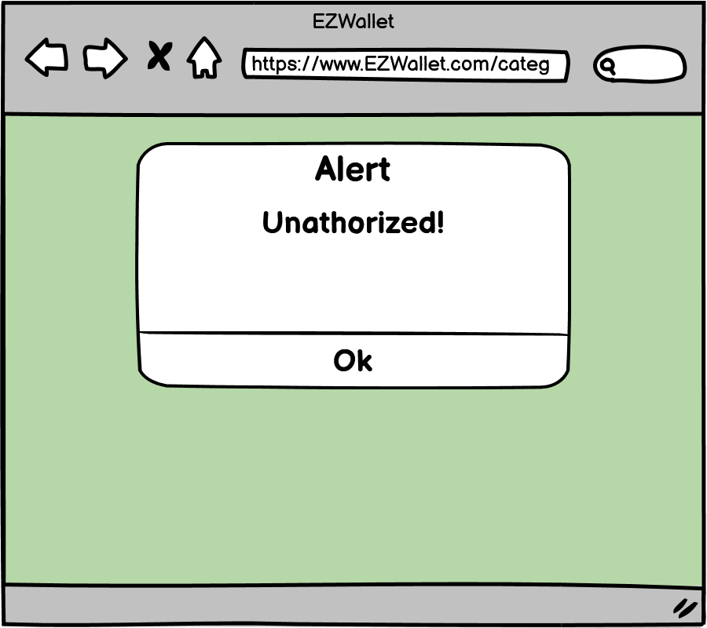
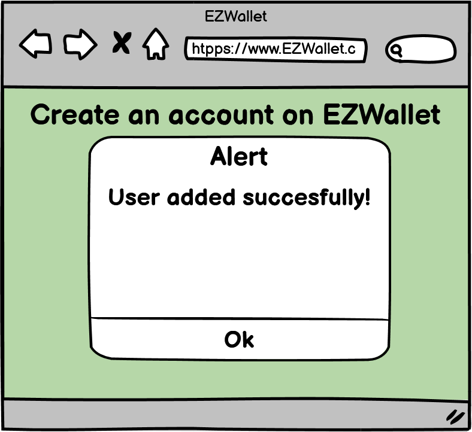
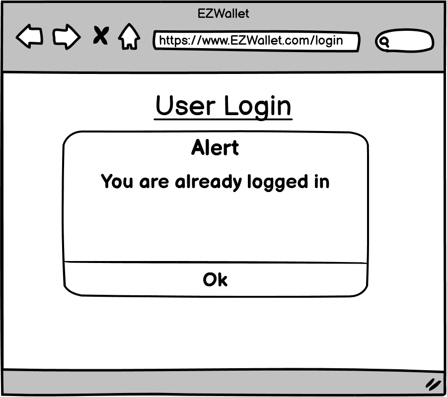
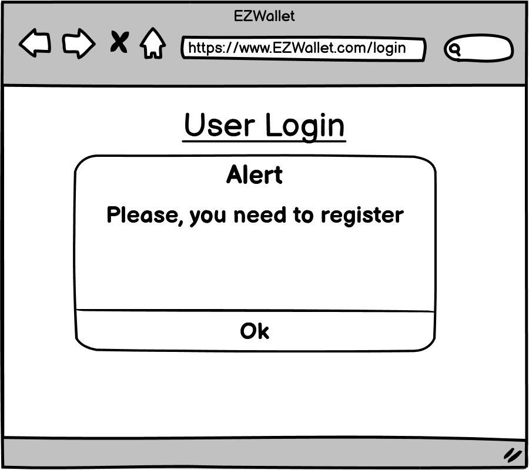

# Graphical User Interface Prototype  - FUTURE

Authors: Francesco Santoro, Rafael Lapetina Ribeiro Gomes, Eric Yugo Hioki, Neda Saadat

Date: 26/04/2023

Version: 1.1

### User already registered error

### User not found error

### Wrong credentials error

### Already Logged out page

### User not authorized error

### User added succesfully

### User already logged in

### User not registered error

### Add category page

### Add expense page

### My categories page

### Delete account page

### Delete category page

### Delete expense page

### Statistics page

### Log out page

### Login interface page

### Password recovery page

### Registration page

### Single category page

### Sum of all transactions' page

