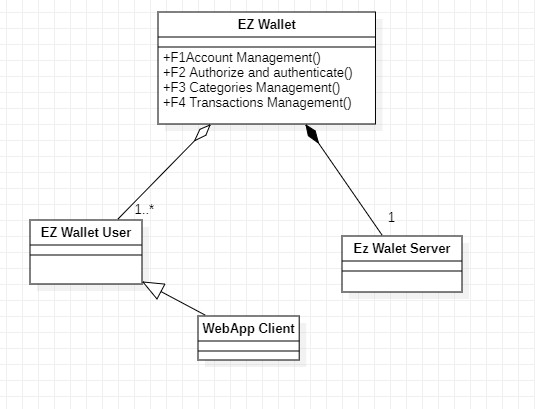

# Requirements Document - current EZWallet

Date: 

Version: V1 - description of EZWallet in CURRENT form (as received by teachers)

 
| Version number | Change |
| ----------------- |:-----------:|
| 1.0 | Add Stakeholder, Stories and Personas, Functional and Non Function requirements |
| 1.1 | Add context diagram and images |
| 1.2 | Add use cases and glossary |
| 1.3 | Add GUI Prototype |
| 1.4 |  |
| 1.5 |  |
| 1.6 |  |

# Contents

- [Informal description](#informal-description)
- [Stakeholders](#stakeholders)
- [Context Diagram and interfaces](#context-diagram-and-interfaces)
	+ [Context Diagram](#context-diagram)
	+ [Interfaces](#interfaces) 
	
- [Stories and personas](#stories-and-personas)
- [Functional and non functional requirements](#functional-and-non-functional-requirements)
	+ [Functional Requirements](#functional-requirements)
	+ [Non functional requirements](#non-functional-requirements)
- [Use case diagram and use cases](#use-case-diagram-and-use-cases)
	+ [Use case diagram](#use-case-diagram)
	+ [Use cases](#use-cases)
    	+ [Relevant scenarios](#relevant-scenarios)
- [Glossary](#glossary)
- [System design](#system-design)
- [Deployment diagram](#deployment-diagram)

# Informal description
EZWallet (read EaSy Wallet) is a software application designed to help individuals and families keep track of their expenses. Users can enter and categorize their expenses, allowing them to quickly see where their money is going. EZWallet is a powerful tool for those looking to take control of their finances and make informed decisions about their spending.

# Stakeholders

| Stakeholder name  | Description | 
| ----------------- |:-----------:|
|   Users     |      People using the app in order to keep track of their expenses could be anyone who wants to manage the expenses of a person or a family)     | 
| Administrator | DB administrator (manages DBMSs on which the app is based) and IT administrator (admin, manages the application) |
| Web server | Services to make the application available | 
| Google Ads Provider | Responsible to provide ads for application |

# Context Diagram and interfaces

## Context Diagram

\<actors are a subset of stakeholders>

## Interfaces
\<describe here each interface in the context diagram>

\<GUIs will be described graphically in a separate document>

| Actor | Logical Interface | Physical Interface  |
| ------------- |:-------------:| -----:|
|   User     | GUI | WEB |
|   Admin   | GUI | PC |
|   Google Ads Provider   | https://ads.google.com/home/ | Internet link |

# Stories and personas

Persona 1:
 - 35 year old female, single mother of 2, low income professional
Story:
 - She wants to keep track of her spendings, to save money and invest the rest of the month’s income. Earns 1000€ monthly and after using it for essential services, she wants to save money and put it in an investment for her children

Persona 2:
 - 22 year old male, student in a foreign country, lives out of parents’ money
Story:
 - This person wants to control his expenses while in a different country from his own, he wants to inform his parents about how much he is spending.

Persona 3:
 - 27 year old male, has a flexible work and travels a lot, medium income
Story:
 - He wants to see how much he is spending during his day to day to save money to plan
next trips with the budget remaining from the month. Using EzWallet he can see how he can avoid
unnecessary spendings. 

Persona 4:
 - Dad of a family, 55 years old, 
Story: 
 - The dad of a family realizes that his family is having too much expenses and wants to control and analyze it in order to reduce them.

Persona 5:
 - 30 year old female in vacation
Story:
A young adult is going to travel and wants to keep track of his expenses during the trip to not surpass his budget.

# Functional and non functional requirements

## Functional Requirements

| ID        | Description  |
| ------------- |:-------------:| 
|  FR1     | Account Management |
| FR1.1    | Register new user |
|  FR2     |  Authorize and authenticate |
|  FR2.1     |  Login |
| FR2.2  | Logout | 
|  FR3     |  Categories Management |
| FR3.1  | Create Categories | 
| FR3.2  | Get Categories | 
|  FR4     |  Transactions Management |
| FR4.1  | Create Transaction | 
| FR4.2  | Delete Transaction | 
| FR4.3  | Get Labels | 

## Non Functional Requirements

| ID        | Type (efficiency, reliability, ..)           | Description  | Refers to |
| ------------- |:-------------:| :-----:| -----:|
|  NFR1     | Security | An identification through email and password is requested. | FR1|
|  NFR2     | Security | Password must be stored hashed in the database | FR1 |
| NFR3 | Security | Users cannot manage the expenses from other users| FR4 | 
| NFR4 | Correctness | Application should retrieve all and only expenses required from the user| FR4 | 
| NFR5 | Efficiency | Application should retrieve all labels in less than 0.5s | FR4.3 | 

# Use case diagram and use cases

## Use case diagram

### Login use case, UC1
| Actors Involved        |  |
| ------------- |:-------------:| 
|  Precondition     | Client already has an account on EZWallet |
|  Post condition     |  User is authenticated and authorized |
|  Nominal Scenario     | Scenario 1.1 |
|  Variants     | Username, password, and email have to be correct |
|  Exceptions     | Scenarios 1.2 and 1.3 |

##### Scenario 1.1 

| Scenario 1.1 | |
| ------------- |:-------------:| 
|  Precondition     | User is unauthenticated |
|  Post condition     | User is authenticated and authorized |
| Step#        | Description  |
|  1     | User opens website |  
|  2     | Session is expired, sent to Login page | 
|  3     | User inserts email and password |  
|  4     | User presses the Login button |
|  5     | User can proceed to visualization of his/her transactions and categories |

##### Scenario 1.2

| Scenario 1.2 | |
| ------------- |:-------------:| 
|  Precondition     | User is unauthenticated |
|  Post condition     | User is unauthenticated |
| Step#        | Description  |
|  1     | User opens website |  
|  2     | Session is expired, sent to Login page |  
|  3     | User inserts email and password |  
|  4     | User presses the Login button |
|  5     | Password is wrong, user gets an error message |
|  6     | User remains in the login page |

##### Scenario 1.3

| Scenario 1.3 | |
| ------------- |:-------------:| 
|  Precondition     | User is unauthenticated |
|  Post condition     | User is unauthenticated |
| Step#        | Description  |
|  1     | User opens website |  
|  2     | Session is expired, sent to Login page |  
|  3     | User inserts email and password |  
|  4     | User presses the Login button |
|  5     | User not found in database, user gets an error message |
|  6     | User remains in the login page |

### Register Account use case, UC2

| Actors Involved        |  |
| ------------- |:-------------:| 
|  Precondition     | Client does not have an account on EZWallet |
|  Post condition     |  User is authenticated and authorized |
|  Nominal Scenario     | Scenario 2.1 |
|  Variants     | - |
|  Exceptions     | Scenario 2.2 |

##### Scenario 2.1 

| Scenario 2.1 | |
| ------------- |:-------------:| 
|  Precondition     | User does not have account |
|  Post condition     | User is authenticated and authorized |
| Step#        | Description  |
|  1     | User opens website and taken to Login page |
|  2     | User clicks on Create new account button |  
|  3     | User inserts email, username and password |  
|  4     | User presses the Sign up button |
|  5     | System creates new user |
|  6     | User can proceed to visualization of his/her transactions and categories |

##### Scenario 2.2

| Scenario 2.2 | |
| ------------- |:-------------:| 
|  Precondition     | User is unauthenticated |
|  Post condition     | User is unauthenticated |
| Step#        | Description  |
|  1     | User opens website and taken to Login page |
|  2     | User clicks on Create new account button |  
|  3     | User inserts email, username and password |  
|  4     | User presses the Sign up button |
|  5     | Email already in use, user gets an error message |
|  6     | User remains in the Login page |

### Logout use case, UC3

| Actors Involved        |  |
| ------------- |:-------------:| 
|  Precondition     | User is authenticated and authorized |
|  Post condition     |  User is unauthenticated |
|  Nominal Scenario     | Scenario 3.1 |
|  Variants     | - |
|  Exceptions     | Scenario 3.2 |

##### Scenario 3.1 

| Scenario 3.1 | |
| ------------- |:-------------:| 
|  Precondition     | User is authenticated |
|  Post condition     | User is unauthenticated in the login page |
| Step#        | Description  |
|  1     | User is in any page while authenticated |  
|  2     | User clicks profile icon in the top right corner |  
|  3     | User clicks Log out button |
|  4     | System resets user's session tokens |
|  5     | User taken to login page |

### Create new Category use case, UC4

| Actors Involved        |  |
| ------------- |:-------------:| 
|  Precondition     | User is authenticated and authorized |
|  Post condition     | New category is in database |
|  Nominal Scenario     | Scenario 4.1 |
|  Variants     | Type and color inputs |
|  Exceptions     | Scenario 4.2 |

#### Scenario 4.1
| Scenario 4.1 | |
| ------------- |:-------------:| 
|  Precondition  | User is authenticated |
|  Post condition | New category added to database |
| Step#        | Description  |
|  1     | User is at categories page |
|  2     | User clicks Add new category button |
|  3     | Two text inputs appear at the bottom |
|  4     | User fills the form with a type and color |
|  5     | User clicks button add |
|  6     | New category added to database |

#### Scenario 4.2
| Scenario 4.2 | |
| ------------- |:-------------:| 
|  Precondition  | User is authenticated |
|  Post condition | New category added to database and user's list |
| Step#        | Description  |
|  1     | User is at categories page |
|  2     | User clicks Add new category button |
|  3     | Two text inputs appear at the bottom |
|  4     | User does leaves form blank |
|  5     | User clicks button add |
|  6     | User gets an error message |

### Add new transaction use case, UC5

| Actors Involved        |  |
| ------------- |:-------------:| 
|  Precondition     | User is authenticated in the transactions page |
|  Post condition     |  New transaction is added to database |
|  Nominal Scenario     | Scenario 5.1 |
|  Variants     | Name, price and date inputs |
|  Exceptions     | User is unauthenticated, Scenario 5.2 |

##### Scenario 5.1 

| Scenario 5.1 | |
| ------------- |:-------------:| 
|  Precondition     | User is authenticaged in the transactions page |
|  Post condition     | Transaction added to database and user list |
| Step#        | Description  |
|  1     | User is in the categories page |
|  2     | User clicks on a certain category |  
|  3     | Page of the selected category is loaded with transactions |  
|  4     | User presses the Add Expense button |
|  5     | Enters another page for filling the expense information | 
|  5     | User fills out form to add new transaction (name, price, date) |
|  6     | User clicks button Add |
|  7     | User is taken back to all transactions view, with the new expense added |

#### Scenario 5.2

| Scenario 5.2 | |
| ------------- |:-------------:| 
|  Precondition | User is authenticated in the transactions page |
|  Post condition | Transaction not added to database |
| Step#        | Description  |
|  1     | User is in the categories page |
|  2     | User clicks on a certain category |  
|  3     | Page of the selected category is loaded with transactions |  
|  4     | User presses the Add Expense button |
|  5     | Enters another page for filling the expense information | 
|  5     | User does not fill out form to add new transaction or adds invalid date |
|  6     | User clicks button Add |
|  7     | User is gets an error message |

### Delete Transaction use case, UC6

| Actors Involved        |  |
| ------------- |:-------------:| 
|  Precondition     | User is authenticated and authorized |
|  Post condition     | Transaction is in not database anymore |
|  Nominal Scenario     | Scenario 6.1 |
|  Variants     | - |
|  Exceptions     | User not authenticated |

#### Scenario 6.1
| Scenario 6.1 | |
| ------------- |:-------------:| 
|  Precondition  | User is authenticated |
|  Post condition | Transaction deleted from database |
| Step#        | Description  |
|  1     | User is at transactions page |
|  2     | User selects a row from transactions table |
|  3     | User clicks button delete |
|  4     | Request sent to server and transaction is deleted from database and user's list in front end |

# Glossary

# System Design

# Deployment Diagram 

\<describe here deployment diagram >

